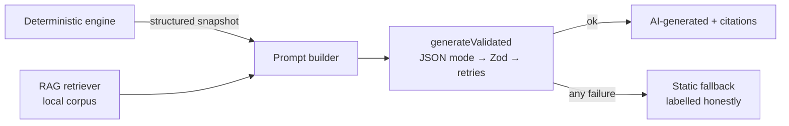

# Nashik Crop Advisor

**Hyperlocal AI Decision Support for Climate-Aware Crop Planning** — Nashik District, Maharashtra.


> **Raw data. Hard limits. No guesswork.**
> A deterministic engine ranks crops against hard agronomic constraints.
> Weather signals are heuristic. AI narrates the results — it never decides.
> Works fully keyless.

## What this is

A portfolio-grade AI engineering prototype combining:

- **Deterministic agricultural engine** — hard constraints → 7-factor suitability scoring → ranking roles → deduction-based confidence. Zero API keys required.
- **Weather intelligence** — Open-Meteo forecasts translated into heuristic advisory signals with LIVE / CACHED / STALE provenance labels.
- **Transparent economics** — per-acre cost/yield/price ranges with honest source classes (`ESTIMATED`, never disguised as measurements).
- **Gemini narration layer** — JSON-mode structured output, Zod-validated, retry ladder, deterministic fallbacks. The LLM cannot alter scores, rankings or constraints.
- **RAG grounding** — a local reference handbook chunked and retrieved lexically; models may cite only passages actually supplied, hallucinated citation ids are dropped server-side.
- **What-if simulator** — stress-test rainfall, price, cost and yield assumptions against the base case.
- **Evaluation harness** — scenario benchmarks, ranking-stability perturbations, retrieval metrics and live-AI audits, reproducible with one command.

The interface is an intentional **modern digital brutalist** composition: paper-and-ink palette with one acid accent, oversized typography, numbered sections and hard geometry.

## Measured quality (recorded runs)

| Gate | Result |
| --- | --- |
| Test suite | **162/162 passing** |
| Scenario expectations | **0/49 failures**, primary accuracy 5/5 |
| Constraint-violation rate | **1.0** |
| Retrieval (14 labelled queries) | P@3 0.93 · R@3 **1.0** · MRR **1.0** |
| Live Gemini (`gemini-3.6-flash`) | fallback rate **0** · first-attempt schema validity **1.0** · hallucinated citations **0** |
| Engine latency | p50 0.63 ms · p95 23.7 ms |

Every number comes from recorded runs in [`evaluation/reports/`](evaluation/reports/EVALUATION_REPORT.md) — see [docs/EVALUATION.md](docs/EVALUATION.md).

## Quick start

```bash
npm install
npm run dev          # full experience, zero API keys needed
```

Optionally add `GEMINI_API_KEY` to `.env.local` for live AI narration (everything degrades to labelled static fallbacks without it).

| Command               | Purpose                                     |
| --------------------- | ------------------------------------------- |
| `npm run dev`         | Start the dev server                        |
| `npm run build`       | Production build                            |
| `npm test`            | Vitest suite                                |
| `npm run lint`        | ESLint                                      |
| `npm run typecheck`   | TypeScript strict check                     |
| `npm run evaluate`    | Deterministic evaluation suite → report     |
| `npm run evaluate:ai` | Live-AI metrics (requires `GEMINI_API_KEY`) |

## Architecture



Full layer map and failure-resilience chain: [docs/ARCHITECTURE.md](docs/ARCHITECTURE.md).

## Data honesty contract

Every important value carries exactly one source label:
`LIVE` · `STATIC` · `ESTIMATED` · `HEURISTIC` · `AI-GENERATED` · `USER-PROVIDED`

This is a decision-support prototype, not an oracle. It will never claim guaranteed yields, profits or disease detection. All agronomic parameters are documented assumptions (`quality: assumed`) pending validation against ICAR / MPKV references — see [docs/LIMITATIONS.md](docs/LIMITATIONS.md).

## Documentation

- [Project Completion Report](docs/PROJECT_COMPLETION_REPORT.md)
- [Architecture](docs/ARCHITECTURE.md)
- [Agricultural Model](docs/AGRICULTURAL_MODEL.md)
- [Decision Engine](docs/DECISION_ENGINE.md)
- [Weather Engine](docs/WEATHER_ENGINE.md)
- [Economic Model](docs/ECONOMIC_MODEL.md)
- [RAG Architecture](docs/RAG_ARCHITECTURE.md)
- [AI Design](docs/AI_DESIGN.md)
- [Evaluation](docs/EVALUATION.md)
- [Limitations](docs/LIMITATIONS.md)
- [Development Log](docs/DEVELOPMENT_LOG.md)

## License

[MIT](LICENSE)
