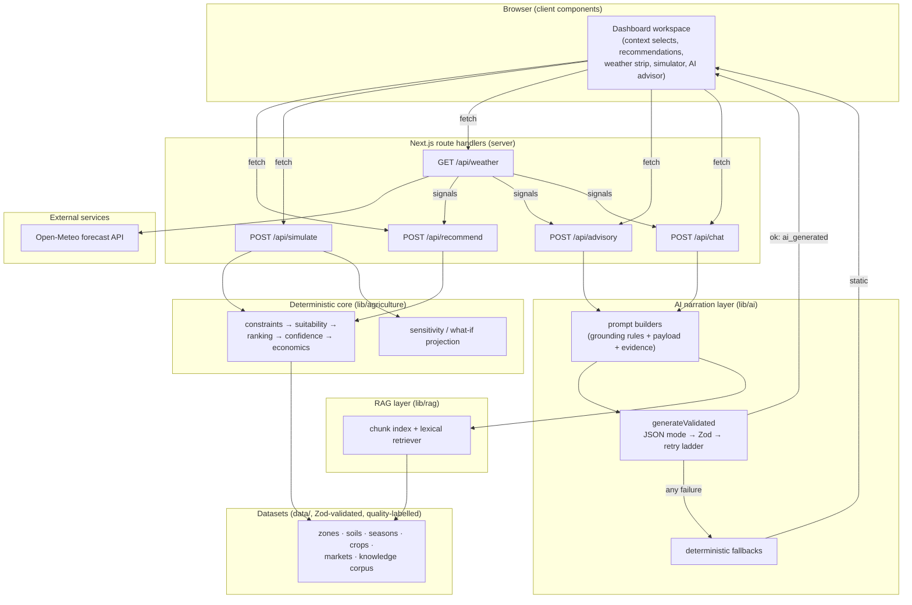

# Architecture

> Status: **finalized (Phase 7)** — all layers implemented and measured.

## System overview



## Layer rules

1. **The deterministic core never calls the LLM; the LLM never feeds back into
   engine state.** Gemini narrates engine snapshots; it cannot alter scores,
   rankings or constraints.
2. **Datasets are the only source of domain truth**, validated by Zod at load
   and labelled with `quality` + disclaimers in their `meta` blocks.
3. **Retrieval is local and deterministic** (`lib/rag`): a lexical TF-IDF over a
   chunked handbook with credibility tiers. It performs no network calls and
   works identically keyless.
4. **Citations are resolved server-side**: models emit `citationIds`, which are
   matched against the exact evidence bundle provided; invented ids are dropped
   before anything reaches the client.

## Failure-resilience chain

Every user-facing value degrades through the same ladder:

```
live → cached → deterministic fallback → honest empty state
```

| Layer | Live | Degraded | Label shown |
| --- | --- | --- | --- |
| Weather | Open-Meteo fetch | fallback-only cache → stale → absent | LIVE / CACHED / STALE |
| Narration | Gemini JSON call | template narrative from engine output | AI-GENERATED / STATIC FALLBACK |
| Retrieval | local corpus | empty evidence bundle (prompt proceeds without it) | — (never fails a request) |
| Economics | market provider seam | static sample dataset | ESTIMATED / SAMPLE |

No failure path can crash a request or present unlabelled data.

## Server/client boundary & secrets

- All dataset loading, engine execution, retrieval and SDK calls happen in
  server route handlers; the client receives finished, labelled JSON.
- `GEMINI_API_KEY` is read only inside `lib/ai/gemini.ts`; it is never sent to
  the browser, never logged, and `.env*` files are gitignored.
- The privacy contract for upstream payloads lives in [AI_DESIGN.md](AI_DESIGN.md);
  tests assert prompts contain no credential material.

## Module map

| Path | Responsibility |
| --- | --- |
| `lib/agriculture` | constraints, scoring, ranking, confidence, economics, sensitivity |
| `lib/weather` | Open-Meteo client, WMO parsing, fallback-only cache |
| `lib/market` | market price provider abstraction |
| `lib/rag` | corpus chunking, lexical retrieval, citation resolution |
| `lib/ai` | prompts, schemas, validated generation, fallbacks, orchestrators |
| `lib/eval` | scenario/retrieval/AI metrics + report renderer |
| `evaluation/` | fixtures, scripts, recorded reports |
| `components/` | dashboard UI with provenance badges everywhere |

Measured behaviour for every layer is recorded in
[`../evaluation/reports/EVALUATION_REPORT.md`](../evaluation/reports/EVALUATION_REPORT.md).
